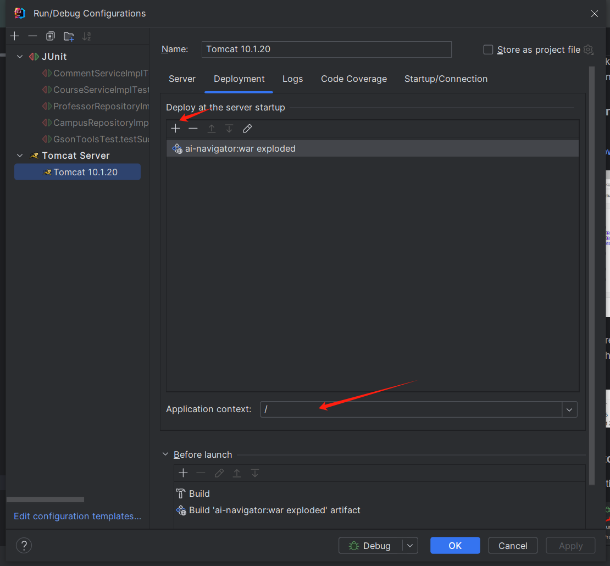

# Run Rate-my-prof Project in IntelliJ

This project is built on __JDK 17__. We use MySQL database and tomcat 10.1.20 to run the service.

## Dependencies

### /web/WEB-INF/lib

These .jar packages should be included in the IntelliJ project to run the service.

c3p0-0.10.0.jar: database connection pool C3p0
mchange-commons-java-0.3.0.jar: database connection pool C3p0
gson-2.10.1.jar: Google JSON tool for Java
jsp-api.jar: Jsp webpage library
servlet-api.jar: Java servlet library
mysql-connector-j-8.3.0.jar: MySQL Driver

###  /lib

These .jar packages should be included in the IntelliJ project to run the JUnit 4 test.

## MySQL Configuration

### Step0: Install MySQL on your computer and start local MySQL services

### Step1: Add MySQL to IntelliJ

Open "Database"  ->  "New"  ->  "Data Source"  -> "MySQL"


Configure the username and password of your local MySQL service. You can use "test connection" to 
make sure that the connection is established.


MySQL Advanced Configuration set allowLoadLocalInfile to true.


### Step2: Initialize data from csv files

Create a database(schema) in your MySQL database.


Please change the directory of the csv files in the "/sql/Insert_Data_From_Excel.sql" file to your local directory.

All the csv files are in the "/csv" folder.

Run /sql/RateMyProfessor.sql to create tables in the database. 

Run /sql/Insert_Data_From_Excel.sql to insert data from csv files to the tables.

When computer prompts Unsafe query: 'Update' statement without 'where' updates all table rows at once, click : "Execute all"


### Step3: Configure database connection pool

This file "/src/c3p0-config.xml" is the database connection pool configuration files. Modify the following content according to
your local MySQL settings.

```xml
<property name="username">your-username</property> // change to your MySQL username
<property name="password">your-password</property> // change to your MySQL password
<property name="driverClass">com.mysql.jdbc.Driver</property>
<property name="jdbcUrl">jdbc:mysql://localhost:3306/your-database-name</property> // change to your MySQL port and database
```

After these configuration, you are prepared to run all the test codes in the "/test" folder

## Tomcat Server configuration

To start this project as a backend service, we need the help of tomcat Java Runtime Environment.

### Step 0: Download tomcat 

Download tomcat server at: https://tomcat.apache.org/download-10.cgi


Extract the zip file somewhere in your computer. This folder "apache-tomcat-10.1.xx" is the root directory of 
the tomcat server.


### Step 1: Add tomcat to your IntelliJ

Open "Run/Debug configuration"


Find "new" -> "Tomcat Server" -> "local"


Find "Server" -> "Configure". Add the tomcat root directory to this "Tomcat home". 
If the "jsp-api.jar" and "servlet-api.jar" is already included in your IntelliJ project, 
there is no need for further operation in the "Library".


Click "deployment" -> "add". You can change the default web resources home path to "/" for your convenience. 



You can now start the backend service running on "localhost:8080" using tomcat in IntelliJ!


